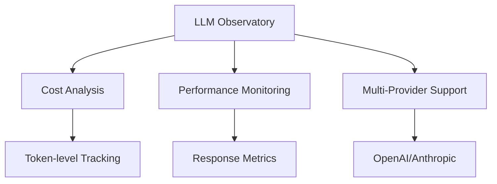
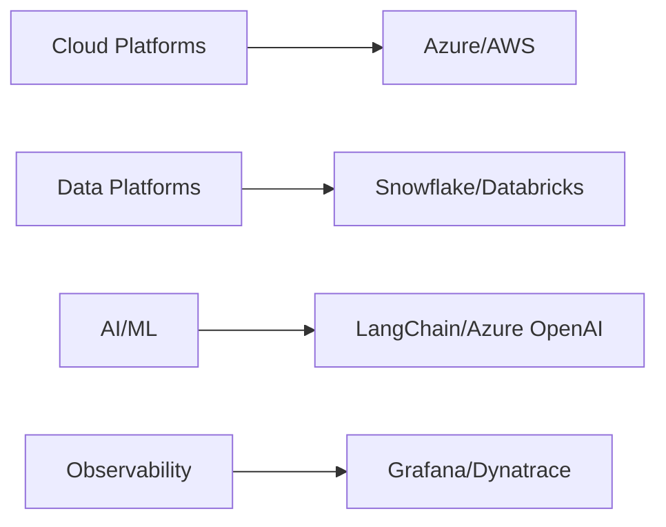
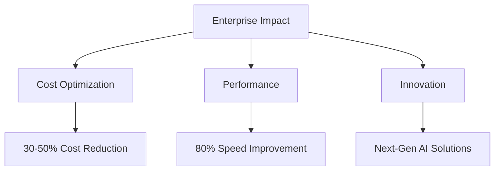

<p align="center">
  <h1 align="center">Pinaki Guha</h1>
  <h3 align="center">Enterprise Data & AI Architecture | Cloud Transformation | Generative AI</h3>
</p>

## 👋 Welcome

Hi, I’m Pinaki — a software and AI architect passionate about building scalable, ethical, and developer-friendly AI systems.My expertise lies in transforming business challenges into scalable, innovative technical solutions that drive measurable impact.
This GitHub profile hosts my personal projects, experiments, and open-source contributions.

## ⚠️ Disclaimer

All repositories in this account represent my **personal work**, created independently for learning, research, or open-source sharing. They do **not** reflect the views, technologies, or proprietary implementations of any current or former employer or client. Unless explicitly stated, all code and content is domain-neutral and avoids use of confidential or sensitive information.

## 🎯 Strategic Focus Areas
- **Enterprise AI Innovation**: Pioneering multi-agent architectures and LLMOps for Fortune 500 companies
- **Cloud Transformation**: Leading large-scale migrations to modern data platforms
- **Data Architecture**: Designing next-generation data ecosystems that power business intelligence
- **Technical Leadership**: Building and mentoring high-performing engineering teams

## 🚀 Enterprise Solutions & Innovation
### Multi-Agent Orchestrator Platform
*For Fortune 500 Pharmaceutical Company*
- Architected a groundbreaking Generative AI platform enhancing sales productivity
- Achieved 50% reduction in platform costs through innovative optimization
- Accelerated application development speed by 80% 
- Led cross-functional teams of engineers and data scientists

### Modern Data Lakehouse Transformation
*For Leading US Banking Institution*
- Spearheaded migration to Azure Cloud Data Lakehouse
- Engineered 30+ enterprise data pipelines
- Reduced operational costs by 30% through ESG reporting automation
- Implemented robust security and governance frameworks

## 💡 Open Source Contributions

### [LLM Observatory](https://github.com/gpinaki/llm-observatory)
*Enterprise LLM Monitoring & Cost Analysis Platform*
```yaml
Core Capabilities:
- Real-time cost tracking across OpenAI & Anthropic
- Multi-environment deployment support (Dev/Test/Int/Prod)
- Advanced performance analytics and monitoring
- Session-based usage tracking and cost optimization
- Production-grade async implementation
```


### [Research Assistant Chatbot](https://github.com/gpinaki/research-assistant-rag)
*Enterprise-Grade RAG Implementation*
```yaml
Key Features:
- Advanced document processing engine
- Enterprise-ready RAG architecture
- Secure multi-document analysis
- Production-grade implementation
```

## 🛠️ Technology Leadership Stack
### Enterprise Platforms & Architecture


### Engineering Excellence
- **Cloud Native**: Kubernetes, Docker, Azure Services
- **Data Engineering**: Snowflake, Databricks, Azure Synapse
- **AI/ML Operations**: LangChain, TruLens, OpenAI, Anthropic
- **Enterprise Integration**: Apigee, ServiceNow, Salesforce
- **LLM Observability**: Cost Analytics, Performance Monitoring, Multi-Environment Management

## 🎓 Executive Certifications & Education
- AI For Business Leaders (Udacity, 2024)
- SnowPro Core Certification (2022)
- Microsoft Certified Azure Developer Associate (2022)
- Duke University - Big Data and Data Science Program (2019)
- Bachelor's in Electrical Engineering - IIEST, Kolkata

## 🌟 Featured Projects Impact


## 🤝 Let's Connect
I'm passionate about mentoring the next generation of data leaders and exploring innovative solutions to complex business challenges.

[](https://www.linkedin.com/in/pinakiguha/)
[](mailto:pinaki.guha@gmail.com)
[](https://github.com/gpinaki)
