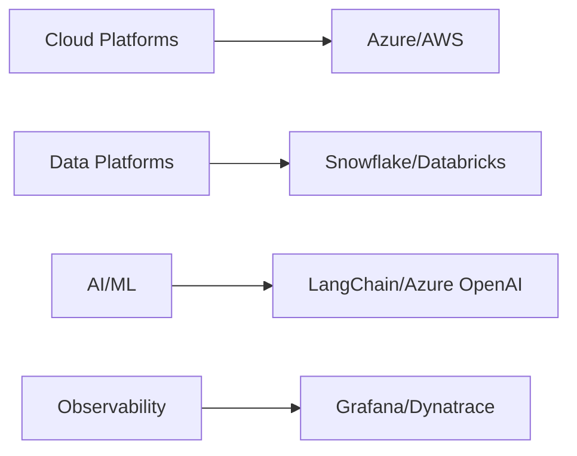

<p align="center">
  <h1 align="center">Pinaki Guha</h1>
  <h3 align="center">Enterprise Data & AI Architecture | Cloud Transformation | Strategic Leadership</h3>
</p>

# 👋 Welcome to My Digital Portfolio

I'm a strategic data leader with 20+ years of experience architecting enterprise-scale data and AI solutions. My expertise lies in transforming business challenges into scalable, innovative technical solutions that drive measurable impact.

## 🎯 Strategic Focus Areas

- **Enterprise AI Innovation**: Pioneering multi-agent architectures and LLMOps for Fortune 500 companies
- **Cloud Transformation**: Leading large-scale migrations to modern data platforms
- **Data Architecture**: Designing next-generation data ecosystems that power business intelligence
- **Technical Leadership**: Building and mentoring high-performing engineering teams

## 🚀 Enterprise Solutions & Innovation

### Multi-Agent Orchestrator Platform
*For Fortune 500 Pharmaceutical Company*
- Architected a groundbreaking Generative AI platform enhancing sales productivity
- Achieved 50% reduction in LLM costs through innovative optimization
- Accelerated application development speed by 80%
- Led cross-functional teams of engineers and data scientists

### Modern Data Lakehouse Transformation
*For Leading US Banking Institution*
- Spearheaded migration to Azure Cloud Data Lakehouse
- Engineered 30+ enterprise data pipelines
- Reduced operational costs by 30% through ESG reporting automation
- Implemented robust security and governance frameworks

## 💡 Open Source Contributions

### [Research Assistant Chatbot](https://github.com/gpinaki/research-assistant-rag)
*Enterprise-Grade RAG Implementation*
```yaml
Key Features:
- Advanced document processing engine
- Enterprise-ready RAG architecture
- Secure multi-document analysis
- Production-grade implementation
```

## 🛠️ Technology Leadership Stack

### Enterprise Platforms & Architecture


### Engineering Excellence
- **Cloud Native**: Kubernetes, Docker, Azure Services
- **Data Engineering**: Snowflake, Databricks, Azure Synapse
- **AI/ML Operations**: LangChain, TruLens, OpenAI
- **Enterprise Integration**: Apigee, ServiceNow, Salesforce

## 🎓 Executive Certifications & Education

- AI For Business Leaders (Udacity, 2024)
- SnowPro Core Certification (2022)
- Microsoft Certified Azure Developer Associate (2022)
- Duke University - Big Data and Data Science Program (2019)
- Bachelor's in Electrical Engineering - IIEST, Kolkata

## 🤝 Let's Connect

I'm passionate about mentoring the next generation of data leaders and exploring innovative solutions to complex business challenges.

[](https://www.linkedin.com/in/pinakiguha/)
[](mailto:pinaki.guha@gmail.com)

---

<p align="center">
<i>"Transforming enterprises through innovative data architecture and AI solutions"</i>
</p>


